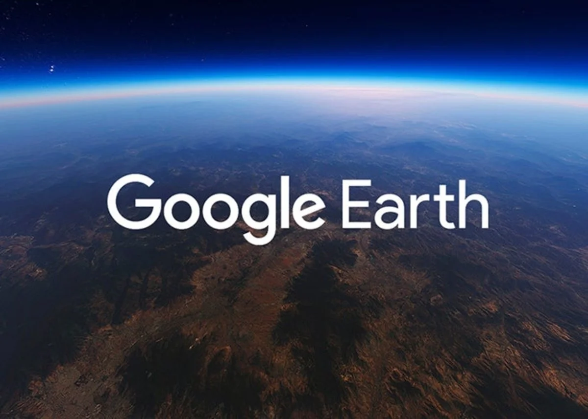
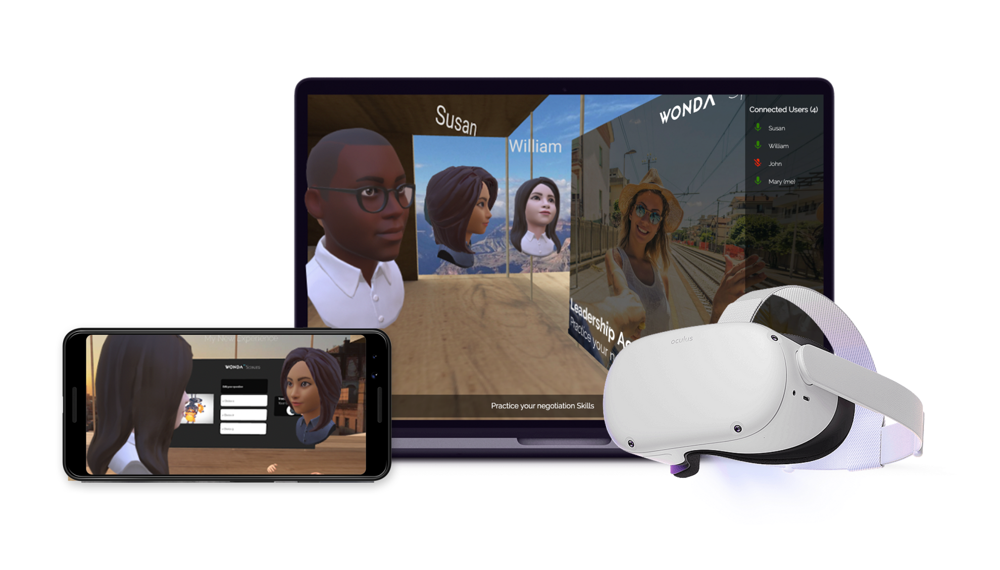
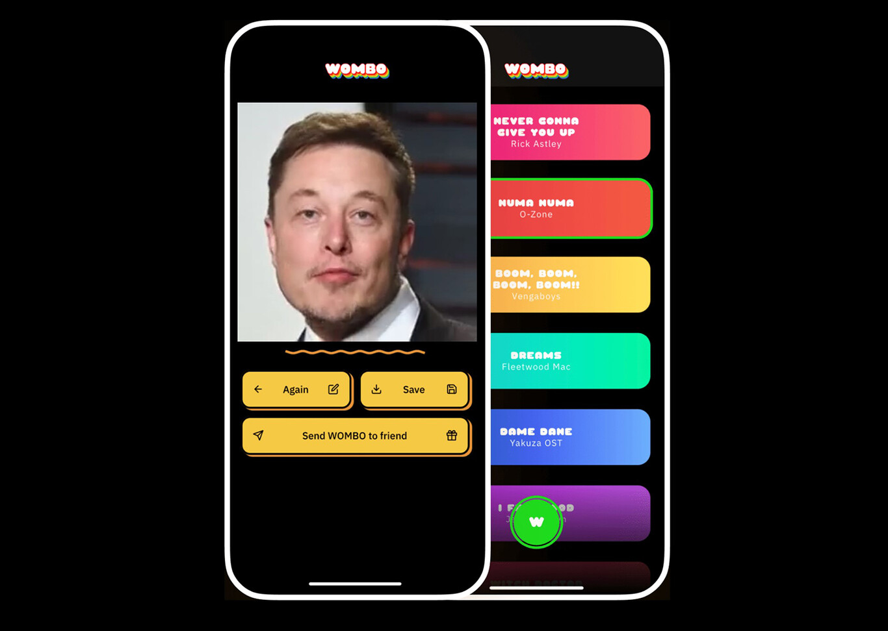
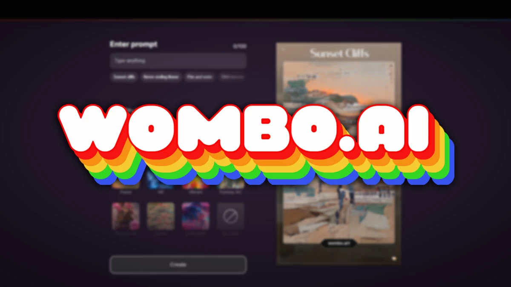

# PEC3: Visionando el futuro con las gafas de Manovich 

### Recurso de aprendizaje de Cultura Digital 

Autor: Alazne Pino Martínez

Fecha: 23/05/2023

## Introducción

Antes de empezar a analizar los dos casos de hibridación que tenemos aquí, primero tenemos que saber qué es. Si buscamos en el diccionario su definición, nos encontramos con producción de seres híbridos o fusión de dos células de distinta estirpe para dar lugar a otra de características mixtas (biol.), pero para encontrar la definición que nosotros buscamos, tenemos una vez más que ponernos las gafas de Manovich. 
La hibridación es un proceso de remediación -de fusión de los medios- que va más allá que la multimedia. (Ferran Adell, 2014)

Como ejemplo de hibridación que nos mostró Manovich en su libro “El software toma el mando” en 2013, tenemos Google Earth. 
Combina fotografía aérea, imágenes satelitales, gráficos por ordenador en 3D, fotografía fija y otros medios para crear una representación híbrida que los ingenieros de Google llaman «una interfaz en 3D del planeta». (Manovich, 2013)

## Re-descubriendo la hibridacion: WondaVR

El primer caso de hibridación al que nos enfrentamos es Wonda VR. Es una empresa especializada en la creación de realidad virtual interactiva. Ofrece una plataforma que permite a los usuarios crear experiencias inmersivas de realidad virtual sin conocimientos previos de programación o de aspectos técnicos. Los usuarios utilizan esta plataforma para crear experiencias inmersivas en varios ámbitos como el marketing o para entrenar, pero lo más fácil y conmemorativo que ha llamado la atención ha sido el e-learning. Su plataforma es compatible con una variedad inmensa de dispositivos de VR, como teléfonos inteligentes o navegadores web, lo que lo hace disponible para un público más amplio que pueda utilizarlo.

Un claro de ejemplo de la efectividad de esta aplicación es la de los alumnos de Harvard, ya que crearon con esta inteligencia artificial un murder mystery (definido como la investigación de un asesinato en español) en el que consiguieron que el usuario pueda aprender un idioma en realidad virtual. La creación de esto solamente les costó dos clases de 75 minutos, mientras que si lo hubiesen hecho desde cero, hubiesen tardado meses. Su funcionamiento se basa en la utilización de varias IAs, como el chat GPT para la creación de las frases y Speech AI Model para las voces de los personajes para generar lo que crean y digan cada uno.

Las inteligencias artificiales por si solas no tienen tanto poder como lo tendrían si se juntan y esto es un claro ejemplo de ello. Combinando las dos IAs que utilizaron los alumnos en la creación de los personajes, han conseguido poder mantener una conversación mientras que estos personajes generan las respuestas solas, por lo que es posible preguntarles cualquier cosa.

"Hemos hecho con Wonda en un par de semanas lo que hubiésemos tardado en Unity más de 6 meses" dice Norman Roy, profesor en la Universidad de Montreal. No solo sirve para enseñar dentro el juego, sino creándolo también. Gracias a esta IA, los alumnos pueden avanzar más rápidamente en la creación de varios proyectos y por ende, avanzar sus estudios a una velocidad más rápida que antes, ya que se puede hacer el doble de cosas en la mitad de tiempo.

Estamos ante un caso de hibridación claro. Como la realidad virtual (VR) y la enseñanza, más concretamente la virtual, se han fusionado gracias a esta inteligencia artificial. Viéndolo desde la perspectiva de Manovich, se hace una unión entre lo físico y lo digital, siendo la enseñanza además de las interacciones y el mundo virtual respectivamente. Podemos ver que esta aplicación ha revolucionado la era digital y la enseñanza, ya que fusiona los medios de enseñanza, como son las clases presenciales y la forma en la que estas se imparten. Definitivamente esto es solo el comienzo de lo que la realidad virtual es capaz.

## Re-descubriendo la hibridacion: Wombo AI draw

El segundo caso de hibridación que vamos a analizar aquí es Wombo AI draw. Es una aplicación principalmente gratuita para dispositivos móviles, aunque los creadores de esta crearon una suscripción mensual para ayudar a su desarrollo. Para que esta funcione, basta con subir un *selfie* o fotografía de una persona, tanto tuya como de alguna persona famosa y la subirá al servidor para ser procesada por su IA (inteligencia artificial) y nos devolverá un vídeo de esa fotografía haciendo *lip-sync* de la canción seleccionada, es decir, simula que la persona está cantando la canción. 

En general, cada vez se utilizan más las inteligencias artificiales. Una inteligencia artificial se puede definir como un sistema que realiza tareas que requieren inteligencia humana y tiene potencial para mejorar y facilitar tareas complejas. Ya hemos puesto en el primer caso el ejemplo del chat GPT y la creación de textos. Los usuarios que utilizan estas inteligencias temen sobre todo la falta de ética y privacidad, ya que necesitan la información recolectada para mejorar, ser más precisas y mejorar sus respuestas, ya que actualmente tienen bastantes fallos.

Es por eso, que esta aplicación tiene algo que puede que a los usuarios que la vayan o quieran utilizar les asuste y es la recolección de datos, ya que para hacer uso de esta aplicación se necesita utilizar imágenes propias. Sin embargo, está especificado que no recolecta los datos ni guarda las imágenes en su servidor.

>"Wombo no almacena tus datos de ninguna forma en ningún sitio, y tampoco se utilizan para entrenar nuestro modelo de ML de ninguna forma o manera. Sí los subimos a nuestro servidor para ejecutar el modelo de Machine Learning sobre ellos y devolver el resultado, pero no se guardan ni son reproducibles".

Estamos ante un caso que hibrida tecnologías IA de dibujo a través de descripción textual. Vamos a ponernos las gafas de Manovich una vez más para ver por qué esta aplicación es una forma de hibridación en la era digital. Fusiona los medios digitales, que son las inteligencias artificiales y los medios físicos, como son las imágenes que crean. Esta aplicación ha revolucionado cómo se utilizan las inteligencias artificiales, ya que cada vez se van a utilizar más de manera que los usuarios den la información que la IA vaya a editar. Aunque todavía quede tiempo para que estas funcionen de un modo adecuado, cada vez que alguien utiliza esta aplicación ayuda al desarrollo de esta misma.

### Referencias y Bibliografía

* Manovich, Lev. (2013). **El Software toma el mando**. Barcelona: Editorial UOC. 
* Adell, Ferran. (2014). "Remediación, multimedia e hibridación de los medios".
* Muñoz-Justicia, Juan (2014): "Conocimiento Abierto y Tecnología".
* McMillan, Robert (2012). "Lord of the Files: How GitHub Tamed Free Software (And More)".
* https://www.xatakandroid.com/aplicaciones-android/wombo-ai-app-que-arrasa-dando-vida-poniendo-a-cantar-tus-selfies
* https://www.wondavr.com/case-studies/ai-mystery

----

Licencia: Material Creative Commons desarrollado bajo licencia CC BY-SA 4.0. Imágenes CC BY [Tubik studio](https://blog.tubikstudio.com/how-to-create-original-flat-illustrations-designers-tips/) 
